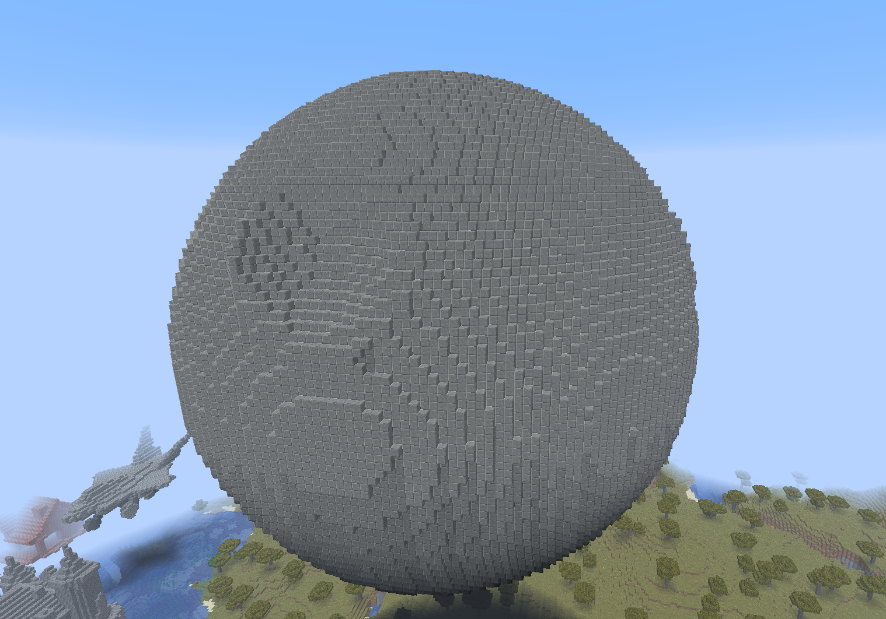
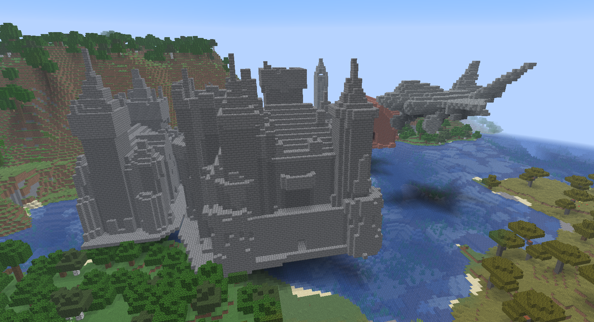
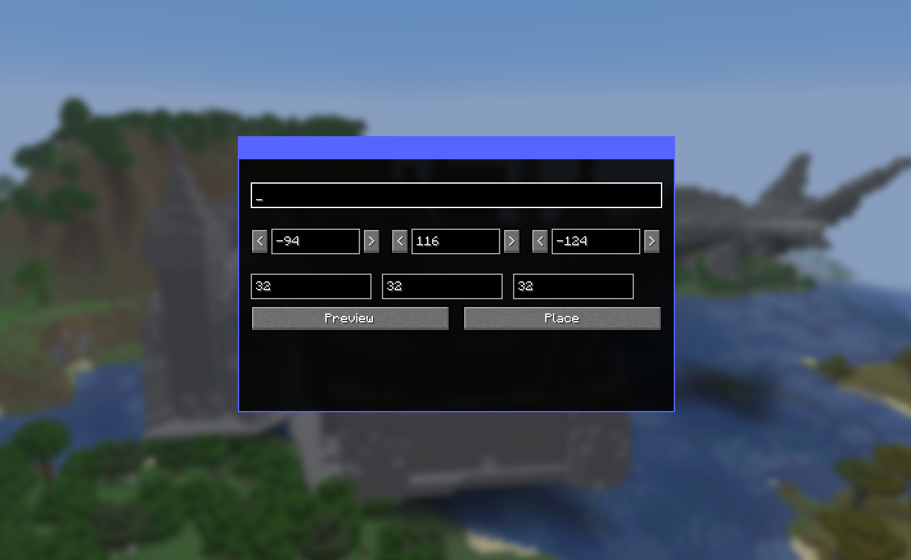

# AI Architect for Minecraft

Turn a sentence into a Minecraft structure. Press **G** in-game, describe what you want to build, and watch it appear block by block.

---

## Demo

<video src="[PASTE_GENERATED_URL_HERE](https://youtu.be/lJ81ANBxTJU)" width="100%"></video>



 




---

## What It Does

Type a prompt like *"a medieval watchtower"* or *"a cozy beach house"* and the AI pipeline researches the structure, generates a 3D model, voxelizes it, and maps it to real Minecraft blocks — all while you watch a live progress bar in-game. Before committing, you get a ghost preview you can reposition with your crosshair.

**Key features:**
- Text-to-structure generation with live progress tracking
- Image-to-structure: upload a reference image, get a build
- Ghost block preview before placement
- Block-by-block placement animation
- Semantic block selection (e.g. the AI picks oak planks, not generic stone, for a cabin)

---

## Architecture

```
┌─────────────────────────────────────────────────────┐
│                  Minecraft Client                   │
│                                                     │
│   [G key] → ArchitectScreen (prompt input)          │
│              ↓                                      │
│           BackendClient (HTTP polling)              │
│              ↓                    ↑                 │
│           BuildHud (progress)  GhostPreview         │
└──────────────────┬──────────────────────────────────┘
                   │  HTTP (POST /generate, GET /builds/{id})
                   ▼
┌─────────────────────────────────────────────────────┐
│                 FastAPI Backend                     │
│                                                     │
│  /generate ──→ job queue ──→ pipeline/runner.py     │
│                                                     │
│  Pipeline stages:                                   │
│    1. Research      (Exa web search + images)       │
│    2. Planning      (GPT-4o vision analysis)        │
│    3. Image Gen     (OpenAI image generation)       │
│    4. Image → 3D   (Fal Trellis GLB model)         │
│    5. Voxelize      (TrimMesh → RGB voxel grid)     │
│    6. Block Map     (nearest-color + LLM refinement)│
│    7. Encode        (RLE + Base64 → mod)            │
└─────────────────────────────────────────────────────┘
```

**Frontend** — Fabric mod (Java). Handles the in-game UI, HTTP communication with the backend, ghost preview rendering, and progressive block placement.

**Backend** — FastAPI (Python). Runs an async job queue that orchestrates the full AI pipeline from prompt to encoded block list.

**Pipeline** — Each stage writes artifacts to disk (`artifacts/{job_id}/`), so any stage can be debugged or replayed independently.

---

## Tech Stack

| Layer | Technology |
|---|---|
| Minecraft mod | Java 25, Fabric Loader, Fabric API |
| Build tool | Gradle + Fabric Loom |
| Backend | Python 3.11+, FastAPI, Uvicorn |
| Research | Exa API |
| Image generation | OpenAI (GPT-4o, DALL·E) |
| 3D model generation | Fal Trellis |
| Voxelization | TrimMesh, NumPy, scikit-image |
| Block mapping | Nearest-color palette + OpenAI semantic refinement |
| Serialization | RLE + Base64 |

---

## Project Structure

```
├── src/
│   ├── main/java/com/example/        # Server-side mod (block placement, networking)
│   └── client/java/com/example/      # Client-side mod (UI, preview, HUD)
├── backend/
│   ├── api/                          # FastAPI routes and schemas
│   ├── pipeline/                     # AI pipeline stages
│   │   ├── research.py
│   │   ├── image_gen/
│   │   ├── generator3d/
│   │   ├── voxelize.py
│   │   ├── block_map/
│   │   └── encode.py
│   ├── storage/                      # In-memory job store
│   └── data/block_palette.json       # Minecraft block → RGB mapping
└── build.gradle
```

---

## Getting Started

### Prerequisites

- Java 25+
- Python 3.11+
- A Minecraft instance with Fabric Loader

### Backend

```bash
cd backend
python -m venv .venv
source .venv/bin/activate        # Windows: .venv\Scripts\activate
pip install -e ".[pipeline,dev]"
cp .env.example .env             # Fill in your API keys
uvicorn main:app --reload --host 127.0.0.1 --port 8000
```

**Required API keys** (`.env`):

| Key | Purpose |
|---|---|
| `OPENAI_API_KEY` | Image generation + block refinement |
| `EXA_API_KEY` | Architectural research |
| `FAL_KEY` | 3D model generation |
| `GEMINI_API_KEY` | Backup LLM (optional) |

### Minecraft Mod

```bash
./gradlew runClient
```

By default the mod connects to `http://127.0.0.1:8000`. Override with:

```
-Dmodid.backendUrl=http://your-host:port
```

---

## Usage

1. Start the backend server
2. Launch Minecraft via `./gradlew runClient`
3. Load a world and press **G**
4. Enter a description and your target coordinates
5. Watch the ghost preview appear — reposition it with your crosshair
6. Click **Place** to build

---

## Running Tests

```bash
cd backend
pytest
```

---

## Roadmap

- [x] Phase 1 — API contract + stubbed pipeline (deterministic sample builds)
- [ ] Phase 2 — Direct LLM block generation (no 3D model)
- [ ] Phase 3 — Full pipeline (research → image → 3D → voxelize → blocks)
- [ ] Phase 4 — Isometric preview, hollow-shell mode, semantic refinement
- [ ] Phase 5 — SQLite persistence, disk cache, retry logic
