# Minecraft AI Mod — Backend Plan

## 1. Goal & Scope

Build a backend service that accepts a text prompt from a Minecraft frontend mod and returns a Minecraft block structure as JSON. The backend handles:

1. Receiving the prompt over HTTP
2. Researching what the thing looks like (Exa — text + reference images)
3. Vision-grounded planning (GPT-4o looks at the Exa images and the prompt)
4. Generating a clean hero image (Fal Flux text-to-image)
5. Generating a 3D mesh from that image (Fal Trellis / Hunyuan3D-2 image-to-3D)
6. Voxelizing the mesh
7. Mapping voxels to Minecraft blocks
8. Returning a compact block-placement JSON

Frontend is out of scope (your teammate). This plan only defines the **API contract** they'll consume.

## 2. Tech Stack (sponsor-aligned)

- **Language/runtime:** Python 3.11 + FastAPI (best ecosystem for ML, mesh ops via `trimesh`, numpy)
- **LLM orchestration:** OpenAI (primary) with Gemini as fallback — both have hackathon credits
- **Web research:** Exa (`/search` with `category="image"` + standard text search) for visual references and descriptions
- **Image generation:** Fal `fal-ai/flux/schnell` (fast, cheap) — generate a clean, isolated, white-background hero image of the subject
- **Image-to-3D:** Fal — primary `fal-ai/trellis` or `fal-ai/hunyuan3d-v2` (state of the art image-to-mesh in 2026)
- **Speed-lane fallback:** Fal `fal-ai/tripo3d/text-to-model` (skip image step entirely when speed > quality)
- **Local fallback (no Fal):** TripoSR or Shap-E via Hugging Face — same `Generator3D` interface
- **Hosting:** **Local for now** — `uvicorn` on the dev machine, share via ngrok/tailscale to teammate if needed. Defer cloud hosting until after MVP.
- **Storage:** Local SQLite for job records, local filesystem under `./artifacts/{job_id}/` for `.glb`, hero image, preview PNG
- **Observability:** Structured logs to stdout (`structlog` or stdlib `logging` with JSON formatter)

Fal credits are temporarily exhausted per the sponsor sheet, so each Fal-using stage is wrapped in a protocol — we can swap to local models or alternate APIs without changing the rest of the pipeline.

## 3. High-Level Architecture

The 3D approach is **text → research → image → 3D**, not direct text-to-3D, because:

- In 2026, image-to-3D models (Trellis, Hunyuan3D-2) are dramatically better than text-to-3D models — the 3D step has a clear visual target, removing language ambiguity
- For specific prompts ("F-22 Raptor", "Eiffel Tower") Exa's reference images ground the result in reality
- For abstract prompts ("a cozy cottage") the GPT-4o-vision-enriched image-gen prompt still produces a great clean image
- We get a **free preview image** (the Flux hero shot) to show the user mid-pipeline
- Output is voxelized into Minecraft blocks anyway, so what matters is **silhouette + color palette** — both nailed by image-to-3D

```mermaid
flowchart LR
    Mod[Minecraft Mod<br/>frontend] -->|"POST /builds {prompt}"| API[Local FastAPI]
    API -->|"job_id"| Mod
    Mod -->|"GET /builds/{id}"| API

    API --> BG[Background Task<br/>asyncio]
    BG --> Research["Exa search<br/>text + reference images"]
    Research --> Vision["GPT-4o vision<br/>look at refs, plan dims,<br/>color palette, image prompt"]
    Vision --> Flux["Fal Flux Schnell<br/>clean hero image<br/>white background"]
    Flux --> ImgTo3D["Fal Trellis or Hunyuan3D-2<br/>image-to-3D mesh"]
    ImgTo3D --> Voxel["Voxelize<br/>trimesh + color sampling"]
    Voxel --> Map["Block mapping<br/>Lab nearest + LLM refine"]
    Map --> Encode["Encode<br/>RLE + base64"]
    Encode --> Store[("SQLite + ./artifacts/")]
    Store --> Mod
```



## 4. API Contract (what your teammate consumes)

Async, polling-based, because 3D gen takes 10-60s.

### `POST /builds`
Request:
```json
{
  "prompt": "a small medieval cottage with a thatched roof",
  "max_size": [48, 48, 48],
  "style_hint": "blocky, low-poly",
  "seed": 42
}
```
Response (immediate):
```json
{ "job_id": "j_abc123", "status": "queued" }
```

### `GET /builds/{job_id}`
Response while running:
```json
{ "job_id": "j_abc123", "status": "running", "stage": "voxelizing", "progress": 0.6 }
```
Response when complete — **the contract for the frontend**:
```json
{
  "job_id": "j_abc123",
  "status": "done",
  "prompt": "a small medieval cottage...",
  "size": [24, 18, 22],
  "origin": [0, 0, 0],
  "palette": [
    "minecraft:air",
    "minecraft:oak_planks",
    "minecraft:cobblestone",
    "minecraft:hay_block"
  ],
  "blocks": "BASE64_RLE_ENCODED_VOXEL_GRID",
  "encoding": "rle-z-y-x",
  "hero_image_url": "http://localhost:8000/static/j_abc123/hero.png",
  "preview_image_url": "http://localhost:8000/static/j_abc123/preview.png"
}
```

`blocks` is a run-length-encoded byte stream over the `size` grid (z-major, then y, then x), with each byte being an index into `palette`. This keeps payloads small (a 48³ build ≈ 110k voxels but RLE typically compresses 10-50x). Document the decode in the README so your teammate can implement it in Java/Kotlin in a few lines.

### `GET /healthz`
Simple liveness check.

## 5. Pipeline Stages (the meat)

### 5.1 Research — Exa (text + images)
Two parallel Exa calls:
- `search(query=prompt, type="auto", contents={text: true})` → 3-5 textual descriptions
- `search(query=prompt, category="image", num_results=5)` → 3-5 reference image URLs

Extract from text: salient visual features, typical color palette, approximate proportions.
Download top 2-3 images to `./artifacts/{job_id}/refs/`.

Cache by prompt hash on local disk (1-week TTL) to avoid burning Exa credits.

### 5.2 Vision-grounded Plan — GPT-4o (multimodal)
Single call to `gpt-4o` (vision) with the Exa reference images attached + the textual snippets + the user's prompt. Use JSON schema response format. Output:
```json
{
  "subject": "medieval cottage",
  "key_features": ["thatched roof", "wooden walls", "stone chimney"],
  "approx_dims": { "w": 24, "h": 18, "d": 22 },
  "preferred_blocks": ["oak_planks", "cobblestone", "hay_block", "oak_log"],
  "image_prompt": "a small medieval cottage, thatched roof, wooden walls, stone chimney, three-quarter view, single isolated subject, plain white background, even studio lighting, no text, no people, photorealistic"
}
```
The `image_prompt` is engineered specifically for image-to-3D: **single subject, isolated, white background, three-quarter view, even lighting, no text/people/background**. These constraints dramatically improve image-to-3D output quality.

Fallback: if no usable Exa images, call `gpt-4o-mini` text-only with the same schema.

### 5.3 Generate Hero Image — Fal Flux
Call `fal-ai/flux/schnell` with the planner's `image_prompt`. Generate **N=2-3 images** in parallel (Flux Schnell is ~1s each), then either:
- (Fast path) take the first
- (Quality path) ask `gpt-4o-mini` "which of these images is best for image-to-3D — single isolated subject, clean background?" and pick

Save the chosen image as `hero.png` in the artifact dir. This is also the `hero_image_url` returned to the frontend, so the user sees what they're getting.

Wrapped behind:
```python
class ImageGenerator(Protocol):
    async def generate(self, prompt: str, n: int, seed: int) -> list[Path]: ...
```

### 5.4 Generate 3D — Fal image-to-3D
Default: `fal-ai/trellis` (Microsoft TRELLIS, current SOTA for image-to-3D in 2026). Fallback chain:
1. `fal-ai/hunyuan3d-v2` (Tencent Hunyuan3D-2)
2. `fal-ai/tripo3d/image-to-model`
3. `fal-ai/triposr` (older, fastest, lower quality)
4. Local `triposr` via Hugging Face (no Fal needed)

A separate **speed-lane** uses `fal-ai/tripo3d/text-to-model` directly with the planner's `image_prompt` text — useful for trivial prompts where the image-gen step adds latency without quality.

All wrapped behind:
```python
class Generator3D(Protocol):
    async def from_image(self, image: Path, seed: int) -> Path: ...   # returns .glb
    async def from_text(self, prompt: str, seed: int) -> Path: ...    # speed lane
```

### 5.5 Voxelize — trimesh
- Load `.glb` with `trimesh`
- Normalize/scale mesh to fit `max_size` while preserving aspect ratio
- `mesh.voxelized(pitch)` to get a sparse voxel grid at ~`max(size)` resolution
- For each filled voxel, sample texture color at voxel center (raycast or nearest-vertex color)
- Output: dense `numpy` `uint8` array of palette indices + parallel `rgb` array

### 5.6 Block Mapping — palette + LLM refine
Two-stage to balance quality and cost:

**Stage A — color nearest-neighbor (fast, deterministic):**
- Pre-built palette: ~80 vanilla "solid" blocks with their dominant Lab color (one-time script using block textures from minecraft assets)
- For each voxel: find nearest block in CIE Lab space (perceptually uniform)

**Stage B — semantic refinement (one LLM call):**
Send OpenAI the planner's `preferred_blocks` plus a histogram of Stage A's chosen blocks, and ask it to remap dominant colors to semantically correct blocks (e.g., "the brown blocks should be `oak_log` not `dirt` because this is a roof").

Optionally swap exterior shell to one block and interior to another using a simple flood-fill from the bounding box.

### 5.7 Encode & Return
- Build the palette table (only blocks actually used)
- Flatten 3D grid to bytes in z-y-x order
- RLE encode → base64
- Render a small isometric preview PNG of the voxelized result with `trimesh` and save to `./artifacts/{job_id}/preview.png`
- Save the full result JSON to SQLite under the job id

## 6. Async Job Pattern (local)

Since we're running locally, no need for a queue or external worker:

- `POST /builds` inserts a job row in SQLite (`status=queued`), spawns an `asyncio.create_task(run_pipeline(job_id))`, and returns the `job_id`
- The pipeline updates `stage`/`progress` in SQLite at each step (or in-memory dict, periodically flushed)
- `GET /builds/{job_id}` reads from SQLite
- A `/static` mount serves files from `./artifacts/` so the frontend can fetch hero/preview images

Start with a single-process server. If runs need parallelism, use a `ConcurrentLimiter` or `asyncio.Semaphore` to cap concurrent Fal calls.

When ready to host (post-MVP), the same code runs on Daytona / Fly.io / a small VM with no changes — the local FS + SQLite is good enough for hackathon scale, and we can later swap in S3 + Postgres behind the same `Storage` interface.

## 7. Project Structure

```
backend/
  api/
    builds.py              # POST/GET handlers (FastAPI router)
    health.py
  pipeline/
    research.py            # Exa client (text + images), local cache
    planner.py             # GPT-4o vision, structured output
    image_gen/
      base.py              # ImageGenerator protocol
      fal_flux.py          # primary
    generator3d/
      base.py              # Generator3D protocol (from_image, from_text)
      fal_trellis.py       # primary
      fal_hunyuan.py
      fal_tripo.py         # speed lane (text-to-3D)
      local_triposr.py     # fallback when Fal unavailable
    voxelize.py            # trimesh-based voxelization + color sampling
    block_map/
      palette.py           # block <-> Lab color table
      nearest.py           # Stage A
      semantic.py          # Stage B (LLM refine)
      __init__.py
    encode.py              # RLE + base64 + isometric preview render
    runner.py              # orchestrates stages, writes progress to SQLite
  storage/
    db.py                  # SQLite jobs table
    artifacts.py           # filesystem layout under ./artifacts/{job_id}/
  config.py                # env vars, model names
  main.py                  # FastAPI app, /static mount, asyncio task scheduler
  scripts/
    build_palette.py       # one-time: scan minecraft block textures -> palette.json
  data/
    palette.json           # generated, committed
  examples/
    sample_response.json   # frozen example for frontend integration
  tests/
    test_voxelize.py
    test_block_map.py
    test_encode_decode.py
  artifacts/               # gitignored; per-job hero.png, mesh.glb, preview.png
  jobs.db                  # gitignored SQLite
  pyproject.toml
  README.md                # API contract + RLE decode example for frontend
  .env.example             # OPENAI_API_KEY, EXA_API_KEY, FAL_KEY, GEMINI_API_KEY
```

## 8. Frontend Hand-off Doc

In `backend/README.md`, document for your teammate:
- Exact request/response JSON
- Java pseudocode for decoding `palette + RLE blocks` into block placements
- A `curl` example
- A sample response JSON committed to `examples/` so they can build the renderer before the backend is fully done

## 9. Suggested Build Phases

Each phase produces a working end-to-end thing your teammate can integrate against.

- **Phase 1 — Skeleton & contract:** Local FastAPI app, `POST/GET /builds`, return a hard-coded sample build (a 5x5x5 cube). Commit `examples/sample_response.json`. Frontend can integrate now.
- **Phase 2 — LLM-only path:** Skip 3D entirely; use OpenAI structured output to directly emit a small block grid for trivial prompts. Validates encode/decode end-to-end with real LLM output.
- **Phase 3 — Real 3D pipeline:** Wire Exa (text + images) → GPT-4o vision planner → Fal Flux → Fal Trellis → voxelize → nearest-Lab-color block map. This is the headline pipeline.
- **Phase 4 — Quality pass:** Add Stage B LLM semantic block refinement, isometric preview image, "shell-only" hollow mode, palette tuning per-prompt.
- **Phase 5 — Polish:** Disk caching for Exa results, error handling, retries with exponential backoff, Gemini fallback for vision/planner, local TripoSR fallback for image-to-3D, structured logs.

## 10. Key Risks & Mitigations

- **Fal credits exhausted** → all Fal stages wrapped in protocols. Swap `image_gen` to OpenAI `gpt-image-1` (we have OpenAI credits) and `generator3d` to local TripoSR with no other code changes.
- **Image-to-3D produces bad meshes** → enforce strict image-prompt constraints (single subject, white bg, three-quarter view), generate N hero images and let GPT-4o-mini pick the best.
- **Voxelized output looks like mush** → tune voxel resolution per prompt size (small things 16³, big things 64³), run Stage B semantic refinement, add a "shell only" mode that hollows the interior.
- **Pipeline too slow (>60s feels broken)** → run image-gen and Exa in parallel with `asyncio.gather`; cache aggressively; the speed-lane (`tripo3d` text-to-model) is a one-flag switch for trivial prompts.
- **API drift with frontend** → commit `examples/sample_response.json` and a Pydantic-derived JSON schema; document the RLE decoder in README with a Java/Kotlin snippet.
- **Sharing local backend with teammate** → `ngrok http 8000` or Tailscale Funnel exposes the local URL; document this in the README.
